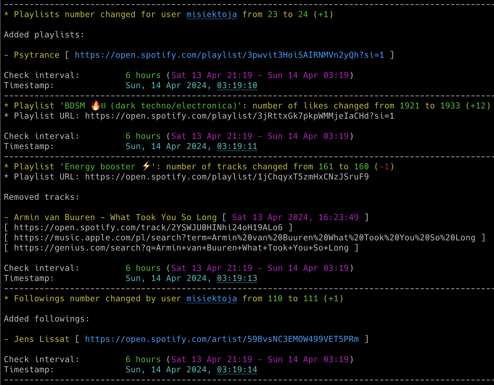
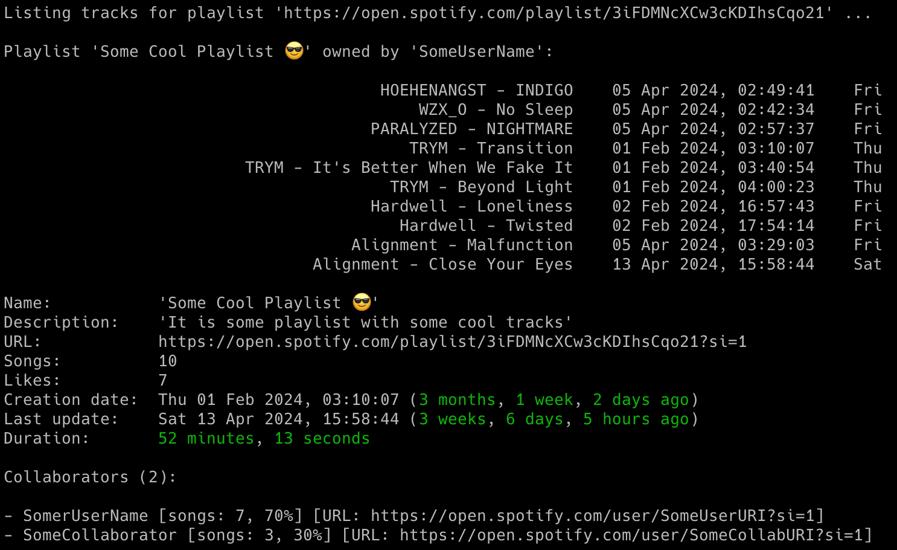
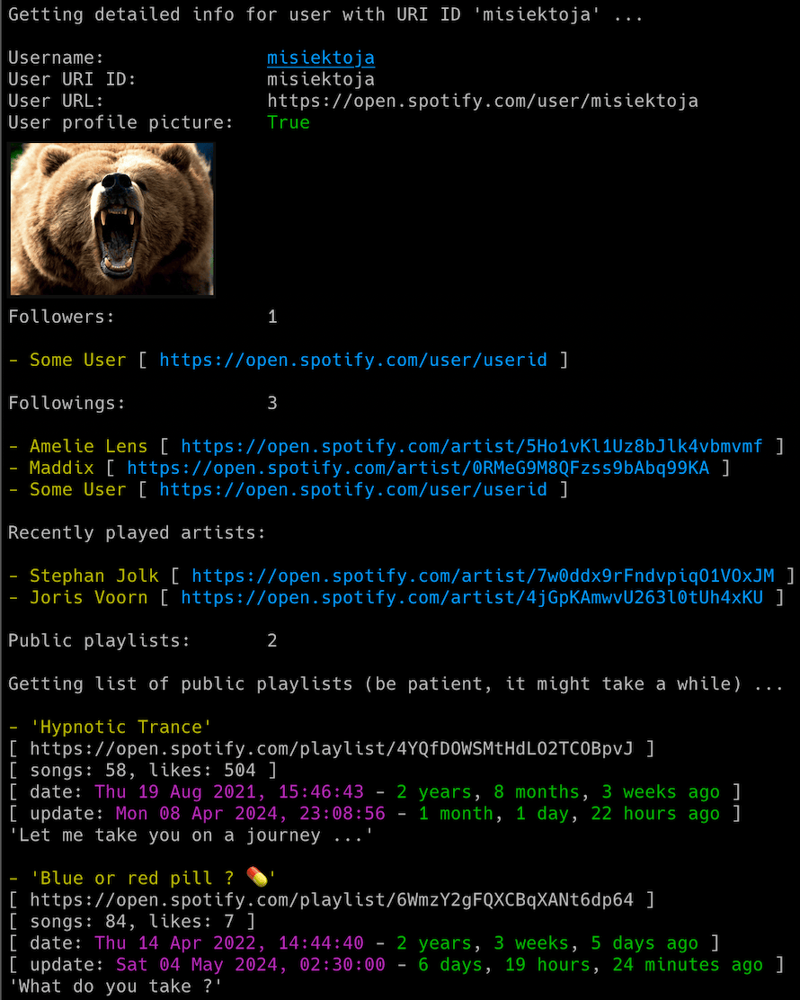
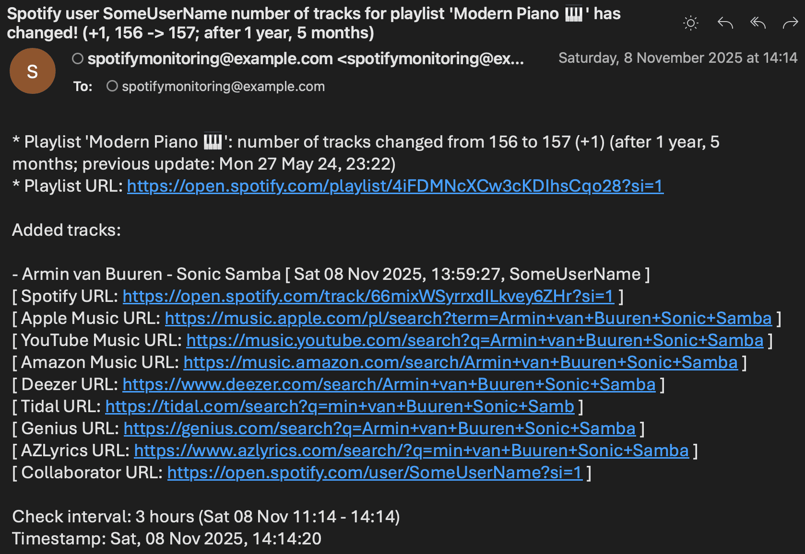

# spotify_profile_monitor

spotify_profile_monitor is an OSINT tool that enables real-time monitoring of Spotify users' activities and profile changes. 

NOTE: If you want to track Spotify friends' music activity, check out another tool I developed: [spotify_monitor](https://github.com/misiektoja/spotify_monitor).

## Features

- Real-time tracking of Spotify user activities and profile changes:
   - addition/removal of followings and followers
   - addition/removal of public playlists
   - addition/removal of tracks in playlists (including collaborator info for newly added tracks)
   - playlists name and description changes
   - number of likes for playlists
   - number of collaborators for playlists
   - profile picture changes
   - username changes
- Email notifications for various events (as listed above)
- Attaching changed profile pictures directly to email notifications
- Displaying the profile picture right in your terminal (if you have *imgcat* installed)
- Additional functionalities on top of the monitoring mode allowing to display detailed info about the user, list of followers & followings, recently played artists and possibility to search for users in Spotify catalog with specific names
- Saving all profile changes with timestamps to the CSV file
- Clickable Spotify, Apple Music, YouTube Music and Genius Lyrics search URLs printed in the console & included in email notifications
- Possibility to control the running copy of the script via signals

<p align="center">
   
</p>

## Change Log

Release notes can be found [here](RELEASE_NOTES.md)

## Requirements

The script requires Python 3.x.

It uses requests, python-dateutil, pytz, tzlocal, urllib3 and pyotp.

It has been tested successfully on:
- macOS (Ventura, Sonoma & Sequoia)
- Linux:
   - Raspberry Pi OS (Bullseye & Bookworm)
   - Ubuntu 24
   - Rocky Linux (8.x, 9.x)
   - Kali Linux (2024, 2025)
- Windows (10 & 11)

It should work on other versions of macOS, Linux, Unix and Windows as well.

## Installation

Install the required Python packages:

```sh
python3 -m pip install requests python-dateutil pytz tzlocal urllib3 pyotp
```

Or from requirements.txt:

```sh
pip3 install -r requirements.txt
```

Copy the *[spotify_profile_monitor.py](spotify_profile_monitor.py)* file to the desired location. 

You might want to add executable rights if on Linux/Unix/macOS:

```sh
chmod a+x spotify_profile_monitor.py
```

## Configuration

Edit the *[spotify_profile_monitor.py](spotify_profile_monitor.py)* file and change any desired configuration variables in the marked **CONFIGURATION SECTION** (all parameters have detailed description in the comments).

### Spotify sp_dc cookie

Log in to the Spotify web client [https://open.spotify.com/](https://open.spotify.com/) in your web browser and copy the value of the sp_dc cookie to the **SP_DC_COOKIE** variable (or use the **-u** parameter).

You can use Cookie-Editor by cgagnier to obtain it easily (available for all major web browsers): [https://cookie-editor.com/](https://cookie-editor.com/)

Newly generated Spotify's sp_dc cookie should be valid for 1 year. You will be informed by the tool once the cookie expires (proper message on the console and in email if error notifications have not been disabled via the **-e** parameter).

It is recommended to create a new Spotify account for use with the tool since we are not using the official Spotify Web API most of the time as most features needed by the tool (like fetching a list of followers/followings, followings count and recently played artists) are not available.

### Timezone

The tool will attempt to automatically detect your local time zone so it can convert Spotify timestamps to your local time. 

If you wish to specify your time zone manually, change the **LOCAL_TIMEZONE** variable from *'Auto'* to a specific location, e.g.

```
LOCAL_TIMEZONE='Europe/Warsaw'
```

In such case it is not needed to install *tzlocal* pip module.

### Spotify sha256 (optional)

This step is optional and only necessary if you want to use the feature to search Spotify's catalog for users with a specific name to obtain their Spotify user URI ID (**-s** parameter).

To do this, you need to intercept your Spotify client's network traffic and obtain the sha256 value.

To simulate the required request, search for the user in the Spotify client. Then, in the intercepting proxy, look for requests with the *searchUsers* or *searchDesktop* operation name.

Display the details of one of these requests and copy the sha256Hash parameter value, then place it in the **SP_SHA256** variable.

Example request:
https://api-partner.spotify.com/pathfinder/v1/query?operationName=searchUsers&variables={"searchTerm":"spotify_user_uri_id","offset":0,"limit":5,"numberOfTopResults":5,"includeAudiobooks":false}&extensions={"persistedQuery":{"version":1,"sha256Hash":"XXXXXXXXXX"}}

You are interested in the string marked as "XXXXXXXXXX" here. 

I used [Proxyman](https://proxyman.io/) proxy to intercept Spotify's client traffic.

### SMTP settings

If you want to use email notifications functionality you need to change the SMTP settings (host, port, user, password, sender, recipient) in the *[spotify_profile_monitor.py](spotify_profile_monitor.py)* file. If you leave the default settings then no notifications will be sent.

You can verify if your SMTP settings are correct by using **-z** parameter (the tool will try to send a test email notification):

```sh
./spotify_profile_monitor.py -z
```

### Other settings

All other variables can be left at their defaults, but feel free to experiment with it.

## Getting started

### How to get user's URI ID

The easiest way is to use your Spotify client. Go to the profile page of the user you want to track and then click 3 dots and select 'Copy link to profile'. For example: [https://open.spotify.com/user/spotify_user_uri_id?si=tracking_id](https://open.spotify.com/user/spotify_user_uri_id?si=tracking_id)

Then use the string after */user/* and before *?si=tracking_id* (*spotify_user_uri_id* in the example) as the user URI ID.

You can also use the built-in functionality to search for usernames (**-s** parameter) to get the user URI ID:

```sh
./spotify_profile_monitor.py -s "user name"
```

It will list all users with such names with their user URI ID. 

Before using this feature make sure you followed the instructions [here](#spotify-sha256)

### List of supported parameters

To get the list of all supported parameters:

```sh
./spotify_profile_monitor.py -h
```

or 

```sh
python3 ./spotify_profile_monitor.py -h
```

### Monitoring mode

To monitor a specific user for all profile changes, simply type the Spotify user URI ID as a parameter (**spotify_user_uri_id** in the example below):

```sh
./spotify_profile_monitor.py spotify_user_uri_id
```

If you have not changed **SP_DC_COOKIE** variable in the *[spotify_profile_monitor.py](spotify_profile_monitor.py)* file, you can use **-u** parameter:

```sh
./spotify_profile_monitor.py spotify_user_uri_id -u "your_sp_dc_cookie_value"
```

By default, only public playlists owned by the user are fetched. You can change this behavior with **-k** parameter. It is helpful in the case of playlists created by another user added to another user profile:

```sh
./spotify_profile_monitor.py spotify_user_uri_id -k
```

If you want to completely disable detection of changes in user's public playlists (like added/removed tracks in playlists, playlists name and description changes, number of likes for playlists), you can use **-q** parameter:

```sh
./spotify_profile_monitor.py spotify_user_uri_id -q
```

The tool will run indefinitely and monitor the user until the script is interrupted (Ctrl+C) or terminated by other means.

You can monitor multiple Spotify users by running multiple copies of the script.

It is recommended to use something like **tmux** or **screen** to keep the script running after you log out from the server (unless you are running it on your desktop).

The tool automatically saves its output to *spotify_profile_monitor_{user_uri_id}.log* file (the log file name suffix can be changed via **-y** parameter or logging can be disabled completely with **-d** parameter).

The tool also saves the list of followings, followers and playlists to these files:
- *spotify_profile_{user_uri_id}_followings.json* 
- *spotify_profile_{user_uri_id}_followers.json*
- *spotify_profile_{user_uri_id}_playlists.json*

Thanks to this we can detect changes after the tool is restarted (the file name suffix {user_uri_id} can be changed to custom one via **-y** parameter).

The tool also saves the user profile picture to *spotify_profile_{user_uri_id}_pic\*.jpeg* files (the file name suffix {user_uri_id} can be changed to custom one via **-y** parameter). 

### Listing mode

There is also another mode of the tool which displays various requested information (**-l**, **-i**, **-a**, **-f** and **-s** parameters). 

If you want to display details for a specific Spotify playlist URL (i.e. its name, description, number of tracks, likes, overall duration, creation and last update date, list of tracks with information on when they were added), then use the **-l** parameter.

```sh
./spotify_profile_monitor.py -l "https://open.spotify.com/playlist/playlist_uri_id"
```

<p align="center">
   
</p>

If you want to display details for a specific Spotify user profile URL (i.e. user URI ID, list and number of followers and followings, recently played artists, list and number of user's playlists with basic statistics like when created, last updated, description, number of tracks and likes) then use the **-i** parameter:

```sh
./spotify_profile_monitor.py -i spotify_user_uri_id
```

<p align="center">
   
</p>

By default, only public playlists owned by the user are fetched. You can change this behavior with **-k** parameter. It is helpful in the case of playlists created by another user added to another user profile:

```sh
./spotify_profile_monitor.py -i spotify_user_uri_id -k
```

If you want to completely disable the processing of a user's public playlists while displaying details for a specific Spotify user profile URL (to speed up the process), you can use the **-q** parameter:

```sh
./spotify_profile_monitor.py -i  spotify_user_uri_id -q
```

If you only want to display the list of followings and followers for the user (**-f** parameter):

```sh
./spotify_profile_monitor.py -f spotify_user_uri_id
```

If you want to display a list of recently played artists (this feature only works if the user has it enabled in their settings), use the **-a** parameter:

```sh
./spotify_profile_monitor.py -a spotify_user_uri_id
```

If you want to search the Spotify catalog for users with a specific name to obtain their Spotify user URI ID (**-s** parameter):

```sh
./spotify_profile_monitor.py -s spotify_user_uri_id
```

You can use the described features regardless of whether the monitoring is used or not (it does not interfere).

## How to use other features

### Email notifications

If you want to receive email notifications for all user profile changes, use the **-p** parameter:

```sh
./spotify_profile_monitor.py spotify_user_uri_id -p
```

Make sure you defined your SMTP settings earlier (see [SMTP settings](#smtp-settings)).

Example email:

<p align="center">
   
</p>

If you would like to disable email notifications about new followers and followings (these are sent by default when the -p option is enabled), use the **-g** parameter:

```sh
./spotify_profile_monitor.py spotify_user_uri_id -p -g
```

### Saving profile changes to the CSV file

If you want to save all profile changes in the CSV file, use **-b** parameter with the name of the file (it will be automatically created if it does not exist):

```sh
./spotify_profile_monitor.py spotify_user_uri_id -b spotify_profile_changes_spotify_user_uri_id.csv
```

### Detection of changed profile pictures

The tool has functionality to detect changed profile pictures. Proper information will be visible in the console (and email notifications when the **-p** parameter is enabled). By default, this feature is enabled, but you can disable it either by setting the **DETECT_CHANGED_PROFILE_PIC** variable to *False* or by enabling the **-j** / **--do_not_detect_changed_profile_pic** parameter.

Since the URL of a Spotify user's profile picture appears to change periodically, the tool identifies any updates in the profile picture by performing a binary comparison of the saved JPEG files. Initially it saves the profile pic to *spotify_profile_{user_uri_id}_pic.jpeg* file after the tool is started (in monitoring mode), then during every check the new picture is fetched and the tool does binary comparison if it has changed or not.

In case of changes the old profile picture is moved to *spotify_profile_{user_uri_id}_pic_old.jpeg* file and the new one is saved to *spotify_profile_{user_uri_id}_pic.jpeg* and also to the file named *spotify_profile_{user_uri_id}_pic_YYmmdd_HHMM.jpeg* (so we can have history of all profile pictures).

### Displaying profile pictures in your terminal

If you have *imgcat* installed, you can enable the feature for displaying pictures right in your terminal. 

To do this, set the path to your *imgcat* binary in the **IMGCAT_PATH** variable (or leave it empty to disable this functionality).

### Check interval 

If you want to change the check interval to 15 minutes (900 seconds), use **-c** parameter:

```sh
./spotify_profile_monitor.py spotify_user_uri_id -c 900
```

### Controlling the script via signals (only macOS/Linux/Unix)

The tool has several signal handlers implemented which allow changing the behavior of the tool without needing to restart it with new parameters.

List of supported signals:

| Signal | Description |
| ----------- | ----------- |
| USR1 | Toggle email notifications for user's profile changes (-p) |
| TRAP | Increase the profile check timer (by 5 minutes) |
| ABRT | Decrease the profile check timer (by 5 minutes) |

So if you want to change the functionality of the running tool, just send the appropriate signal to the desired copy of the script.

I personally use the **pkill** tool. For example, to toggle email notifications for user profile changes for the tool instance monitoring the user with the *spotify_user_uri_id*:

```sh
pkill -f -USR1 "python3 ./spotify_profile_monitor.py spotify_user_uri_id"
```

As Windows supports limited number of signals, this functionality is available only on Linux/Unix/macOS.

### Other

Check other supported parameters using **-h**.

You can combine all the parameters mentioned earlier in monitoring mode (listing mode only supports **-l**, **-i**, **-a**, **-f**, **-s**, **-q**, **-k**).

## Coloring log output with GRC

If you use [GRC](https://github.com/garabik/grc) and want to have the tool's log output properly colored you can use the configuration file available [here](grc/conf.monitor_logs)

Change your grc configuration (typically *.grc/grc.conf*) and add this part:

```
# monitoring log file
.*_monitor_.*\.log
conf.monitor_logs
```

Now copy the *conf.monitor_logs* to your *.grc* directory and spotify_profile_monitor log files should be nicely colored when using *grc* tool.

## License

This project is licensed under the GPLv3 - see the [LICENSE](LICENSE) file for details
