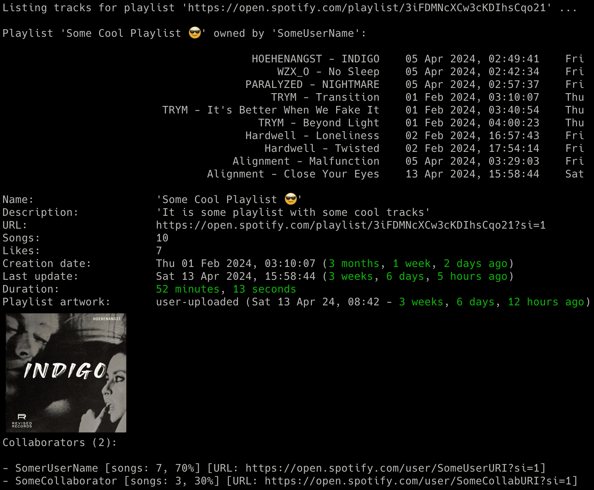

# spotify_profile_monitor

spotify_profile_monitor is an OSINT tool written in Python which allows for real-time monitoring of Spotify users activities and profile changes. 

NOTE: If you want to track Spotify friends music activity check out the other tool I developed: [spotify_monitor](https://github.com/misiektoja/spotify_monitor).

## Features

- Real-time tracking of Spotify user activities and profile changes:
   - added/removed followings and followers
   - added/removed public playlists
   - added/removed tracks in playlists
   - playlists name and description changes
   - number of likes for playlists
   - changed profile pictures
   - username changes
- Email notifications for different events (added/removed followings + followers + public playlists + its tracks, playlists name and description changes, changed profile pictures, username changes, number of likes for playlists, errors)
- Attaching changed profile pictures directly in email notifications
- Displaying the profile picture right in your terminal (if you have *imgcat* installed)
- Additional functionalities on top of the monitoring mode allowing to display detailed info about the user, list of followers & followings, recently played artists and possibility to search for users with specific names
- Saving all profile changes with timestamps to the CSV file
- Clickable Spotify, Apple Music, YouTube Music and Genius Lyrics search URLs printed in the console & included in email notifications
- Possibility to control the running copy of the script via signals

<p align="center">
   
</p>

## Change Log

Release notes can be found [here](RELEASE_NOTES.md)

## Disclaimer

I'm not a dev, project done as a hobby. Code is ugly and as-is, but it works (at least for me) ;-)

## Requirements

The script requires Python 3.x.

It uses requests, python-dateutil, pytz, tzlocal and urllib3.

It has been tested successfully on:
- macOS (Ventura, Sonoma & Sequoia)
- Linux:
   - Raspberry Pi Bullseye & Bookworm
   - Ubuntu 24
   - Rocky Linux 8.x
   - Kali Linux 2024
- Windows (10 & 11)

It should work on other versions of macOS, Linux, Unix and Windows as well.

## Installation

Install the required Python packages:

```sh
python3 -m pip install requests python-dateutil pytz tzlocal urllib3
```

Or from requirements.txt:

```sh
pip3 install -r requirements.txt
```

Copy the *[spotify_profile_monitor.py](spotify_profile_monitor.py)* file to the desired location. 

You might want to add executable rights if on Linux/Unix/macOS:

```sh
chmod a+x spotify_profile_monitor.py
```

## Configuration

Edit the *[spotify_profile_monitor.py](spotify_profile_monitor.py)* file and change any desired configuration variables in the marked **CONFIGURATION SECTION** (all parameters have detailed description in the comments).

### Spotify sp_dc cookie

Log in to Spotify web client [https://open.spotify.com/](https://open.spotify.com/) in your web browser and copy the value of sp_dc cookie to **SP_DC_COOKIE** variable (or use **-u** parameter). 

You can use Cookie-Editor by cgagnier to get it easily (available for all major web browsers): [https://cookie-editor.com/](https://cookie-editor.com/)

Newly generated Spotify's sp_dc cookie should be valid for 1 year. You will be informed by the tool once the cookie expires (proper message on the console and in email if errors notifications have not been disabled via **-e** parameter).

It is suggested to create a new Spotify account for usage with the tool since we are not using official Spotify Web API most of the time (as some needed features were not available).

### Timezone

The tool will try to automatically detect your local time zone so it can convert Spotify timestamps to your time. 

In case you want to specify your timezone manually then change **LOCAL_TIMEZONE** variable from *'Auto'* to specific location, e.g.

```
LOCAL_TIMEZONE='Europe/Warsaw'
```

In such case it is not needed to install *tzlocal* pip module.

### Spotify sha256

This step is optional and only needed if you want to use the feature to search for users with specific name to get their Spotify user URI ID (**-s** parameter).

For that you need to intercept your Spotify client's network traffic and get the sha256 value.

To simulate the needed request, search for some user in Spotify client. Then in intercepting proxy look for requests with *searchUsers* or *searchDesktop* operation name.

Display details of one of such requests and copy the sha256Hash parameter value and put it in **SP_SHA256** variable.

Example request:
https://api-partner.spotify.com/pathfinder/v1/query?operationName=searchUsers&variables={"searchTerm":"misiektoja","offset":0,"limit":5,"numberOfTopResults":5,"includeAudiobooks":false}&extensions={"persistedQuery":{"version":1,"sha256Hash":"XXXXXXXXXX"}}

You are interested in the string marked as "XXXXXXXXXX" here. 

I used [Proxyman](https://proxyman.io/) proxy on MacOS to intercept Spotify's client traffic.

### SMTP settings

If you want to use email notifications functionality you need to change the SMTP settings (host, port, user, password, sender, recipient) in the *[spotify_profile_monitor.py](spotify_profile_monitor.py)* file. If you leave the default settings then no notifications will be sent.

You can verify if your SMTP settings are correct by using **-z** parameter (the tool will try to send a test email notification):

```sh
./spotify_profile_monitor.py -z
```

### Other settings

All other variables can be left at their defaults, but feel free to experiment with it.

## Getting started

### List of supported parameters

To get the list of all supported parameters:

```sh
./spotify_profile_monitor.py -h
```

or 

```sh
python3 ./spotify_profile_monitor.py -h
```

### Monitoring mode

To monitor specific user for all profile changes, just type Spotify user URI ID as parameter (**misiektoja** in the example below):

```sh
./spotify_profile_monitor.py misiektoja
```

If you have not changed **SP_DC_COOKIE** variable in the *[spotify_profile_monitor.py](spotify_profile_monitor.py)* file, you can use **-u** parameter:

```sh
./spotify_profile_monitor.py misiektoja -u "your_sp_dc_cookie_value"
```

The tool will run infinitely and monitor the user until the script is interrupted (Ctrl+C) or killed the other way.

You can monitor multiple Spotify users by spawning multiple copies of the script. 

It is suggested to use sth like **tmux** or **screen** to have the script running after you log out from the server (unless you are running it on your desktop).

The tool automatically saves its output to *spotify_profile_monitor_{user_uri_id}.log* file (the log file name suffix can be changed via **-y** parameter or logging can be disabled completely with **-d** parameter).

The tool also saves the list of followings, followers and playlists to these files:
- *spotify_profile_{user_uri_id}_followings.json* 
- *spotify_profile_{user_uri_id}_followers.json*
- *spotify_profile_{user_uri_id}_playlists.json*

Thanks to this we can detect changes after the tool is restarted (the file name suffix {user_uri_id} can be changed to custom one via **-y** parameter).

The tool also saves the user profile picture to *spotify_profile_{user_uri_id}_pic\*.jpeg* files (the file name suffix {user_uri_id} can be changed to custom one via **-y** parameter). 

### How to get user's URI ID

The easiest way is to use your Spotify client. Go to the profile page of your friend and then click 3 dots and select 'Copy link to profile'. In my case it is: [https://open.spotify.com/user/misiektoja](https://open.spotify.com/user/misiektoja)

Then use the string after */user/* (*misiektoja* in the example) as user URI ID.

You can also use built-in functionality to search for user names (**-s** parameter) to get user URI ID:

```sh
./spotify_profile_monitor.py -s "misiektoja"
```

It will list all users with such names with their user URI ID. 

Before using this feature make sure you followed the instructions [here](#spotify-sha256)

### Listing mode

There is also other mode of the tool which displays different requested information (**-l**, **-i**, **-a**, **-f** and **-s** parameters). 

If you want to display details for specific Spotify playlist URL (i.e. its name, description, number of tracks, likes, overall duration, creation & last update date, list of tracks with information when they have been added), then use **-l** parameter:

```sh
./spotify_profile_monitor.py -l "https://open.spotify.com/playlist/33u3A8wbd6Q54in8zJ1cWE"
```

<p align="center">
   
</p>

If you want to display details for specific Spotify user profile URL (i.e. user URI ID, list & number of followers and followings, recently played artists, list & number of user's playlists with basic statistics like when created, last updated, description, number of tracks and likes), then use **-i** parameter:

```sh
./spotify_profile_monitor.py -i misiektoja
```

<p align="center">
   
</p>

If you only want to display list of followings & followers for the user (**-f** parameter):

```sh
./spotify_profile_monitor.py -f misiektoja
```

If you only want to display list of recently played artists (**-a** parameter):

```sh
./spotify_profile_monitor.py -a misiektoja
```

And if you want to search for users with specific name to get their Spotify user URI ID (**-s** parameter):

```sh
./spotify_profile_monitor.py -s misiektoja
```

You can use the described features regardless if the monitoring is used or not (it does not interfere). 

## How to use other features

### Email notifications

If you want to get email notifications for all user profile changes use **-p** parameter:

```sh
./spotify_profile_monitor.py misiektoja -p
```

Make sure you defined your SMTP settings earlier (see [SMTP settings](#smtp-settings)).

Example email:

<p align="center">
   
</p>

### Saving profile changes to the CSV file

If you want to save all profile changes in the CSV file, use **-b** parameter with the name of the file (it will be automatically created if it does not exist):

```sh
./spotify_profile_monitor.py misiektoja -b spotify_profile_changes_misiektoja.csv
```

### Detection of changed profile pictures

The tool has functionality to detect changed profile pictures. Proper information will be visible in the console (and email notifications when **-p** parameter is enabled). By default this feature is enabled, but you can disable it either by setting **DETECT_CHANGED_PROFILE_PIC** variable to *False* or by enabling **-j** / **--do_not_detect_changed_profile_pic** parameter.

Since Spotify user's profile picture URL seems to change from time to time, the tool detects changed profile picture by doing binary comparison of saved jpeg files. Initially it saves the profile pic to *spotify_profile_{user_uri_id}_pic.jpeg* file after the tool is started (in monitoring mode), then during every check the new picture is fetched and the tool does binary comparison if it has changed or not.

In case of changes the old profile picture is moved to *spotify_profile_{user_uri_id}_pic_old.jpeg* file and the new one is saved to *spotify_profile_{user_uri_id}_pic.jpeg* and also to the file named *spotify_profile_{user_uri_id}_pic_YYmmdd_HHMM.jpeg* (so we can have history of all profile pictures).

### Displaying profile pictures in your terminal

if you have *imgcat* installed you can enable the feature displaying pictures right in your terminal. For that put path to your *imgcat* binary in **IMGCAT_PATH** variable (or leave it empty to disable this functionality).

### Check interval 

If you want to change the check interval to 15 minutes (900 seconds) use **-c** parameter:

```sh
./spotify_profile_monitor.py misiektoja -c 900
```

### Controlling the script via signals (only macOS/Linux/Unix)

The tool has several signal handlers implemented which allow to change behavior of the tool without a need to restart it with new parameters.

List of supported signals:

| Signal | Description |
| ----------- | ----------- |
| USR1 | Toggle email notifications for user's profile changes (-p) |
| TRAP | Increase the profile check timer (by 5 minutes) |
| ABRT | Decrease the profile check timer (by 5 minutes) |

So if you want to change functionality of the running tool, just send the proper signal to the desired copy of the script.

I personally use **pkill** tool, so for example to toggle email notifications for user's profile changes, for the tool instance monitoring the *misiektoja* user:

```sh
pkill -f -USR1 "python3 ./spotify_profile_monitor.py misiektoja"
```

As Windows supports limited number of signals, this functionality is available only on Linux/Unix/macOS.

### Other

Check other supported parameters using **-h**.

You can combine all the parameters mentioned earlier in monitoring mode (listing mode only supports **-l**, **-i**, **-a**, **-f**, **-s**).

## Coloring log output with GRC

If you use [GRC](https://github.com/garabik/grc) and want to have the tool's log output properly colored you can use the configuration file available [here](grc/conf.monitor_logs)

Change your grc configuration (typically *.grc/grc.conf*) and add this part:

```
# monitoring log file
.*_monitor_.*\.log
conf.monitor_logs
```

Now copy the *conf.monitor_logs* to your *.grc* directory and spotify_profile_monitor log files should be nicely colored when using *grc* tool.

## License

This project is licensed under the GPLv3 - see the [LICENSE](LICENSE) file for details
